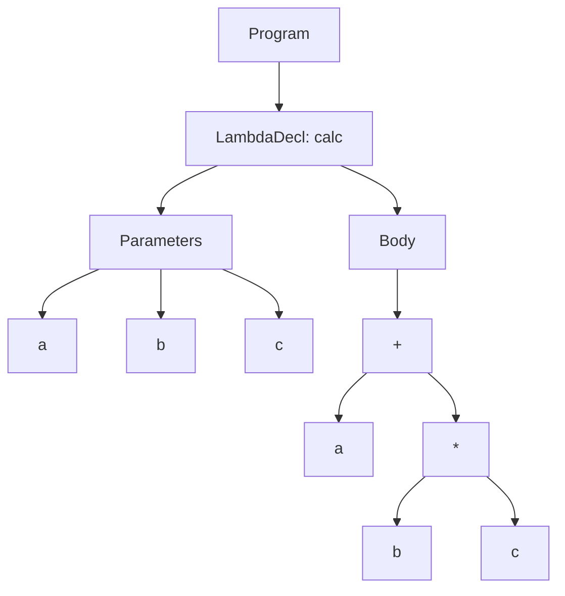

# Лабораторная работа 5: Построение AST и семантический анализ

**Автор:** Ситников В.И.  
**Проект:** JavaFX языковой процессор для лямбда-выражений Python-формата

## Вариант задания
Обрабатываемая конструкция:

```python
calc = lambda a, b, c: a + (b * c);
```

Примеры корректных строк:

```python
calc = lambda a, b, c: a + (b * c);
sum2 = lambda x, y: x + y;
id = lambda z: z;
```

## Реализованные контекстно-зависимые условия

1. **Уникальность идентификаторов**
- Проверяется повторное объявление имени функции в глобальной области.
- Проверяется повторное объявление имени параметра в области параметров лямбда-выражения.
- Пример:

```python
calc = lambda a: a;
calc = lambda b: b;
```

Ожидаемое сообщение:
- `Семантическая ошибка: Идентификатор "calc" уже объявлен ранее в этой области видимости. (строка 2, символ ...)`

2. **Совместимость типов**
- Для арифметических операций `+`, `-`, `*`, `/` оба операнда должны быть типа `Int`.
- Использование имени ранее объявленной лямбда-функции как числа считается несовместимостью типов.
- Пример:

```python
f = lambda x: x;
g = lambda a: a + f;
```

Ожидаемое сообщение:
- `Семантическая ошибка: Несовместимость типов: арифметические операторы применимы только к типу Int.`

3. **Допустимые значения**
- Числовой литерал проверяется на попадание в диапазон `Int` (`Integer.MIN_VALUE ... Integer.MAX_VALUE`).
- Пример:

```python
calc = lambda: 999999999999999999999999;
```

Ожидаемое сообщение:
- `Семантическая ошибка: Числовой литерал "..." выходит за допустимые пределы типа Int.`

4. **Использование идентификаторов**
- Идентификатор в выражении должен быть объявлен ранее (параметр текущей лямбды или ранее объявленная функция).
- Пример:

```python
calc = lambda a: a + b;
```

Ожидаемое сообщение:
- `Семантическая ошибка: Идентификатор "b" используется до объявления.`

## Структура AST

Типы узлов:
- `ProgramNode` — корень программы.
- `LambdaDeclNode` (`LambdaDeclarationNode`) — объявление лямбда-функции.
- `ParameterNode` — параметр функции.
- `BinaryOpNode` — бинарная операция.
- `IdentifierNode` — идентификатор.
- `IntLiteralNode` (`NumberLiteralNode`) — целочисленный литерал.

Пример AST (текстовый вывод):

```text
ProgramNode
└── LambdaDeclNode
    ├── name: "calc"
    ├── parameters:
    ├── ParameterNode
    │   └── name: "a"
    ├── ParameterNode
    │   └── name: "b"
    ├── ParameterNode
    │   └── name: "c"
    ├── body:
    └── BinaryOpNode
        ├── operator: "+"
        ├── IdentifierNode
        │   └── name: "a"
        └── BinaryOpNode
            ├── operator: "*"
            ├── IdentifierNode
            │   └── name: "b"
            └── IdentifierNode
                └── name: "c"
```

### CST / AST (схема для корректной строки)



## Формат вывода в программе

После нажатия `Пуск`:
- В поле `AST (текстовый вид)` отображается AST только для семантически корректных объявлений.
- В поле `Сообщения об ошибках` отображаются ошибки с позицией: строка и символ.
- Отдельно отображается строка `Количество ошибок: N`.

Дополнительно:
- Кнопка `Показать AST` открывает отдельное графическое окно AST.

## Графическая визуализация AST

Использованы средства JavaFX:
- `TreeView<String>` для отображения узлов AST.
- `TreeItem<String>` для построения иерархии узлов (родитель -> потомок).
- Отдельное окно (`Stage`) открывается по кнопке `Показать AST`.

Каждый узел отображается с типом и ключевыми атрибутами:
- `LambdaDeclNode [name=...]`
- `ParameterNode [name=...]`
- `BinaryOpNode [op=...]`
- `IdentifierNode [name=...]`
- `IntLiteralNode [value=...]`

## Тестовые примеры

Покрытые сценарии:
- Корректная строка.
- Отсутствие `;`.
- Повторное объявление функции.
- Повторный параметр.
- Использование необъявленного идентификатора.
- Невалидный числовой диапазон.
- Несовместимость типов (использование лямбды как числа).

Юнит-тесты расположены в:
- `src/test/java/parser/LambdaParserTest.java`

## Инструкция по запуску

1. Установить JDK (версия, совместимая с проектом Maven).
2. В корне проекта выполнить:

```bash
mvn clean test
mvn javafx:run
```

3. В интерфейсе:
- Ввести код в редактор.
- Нажать `Пуск` для синтаксико-семантического анализа.
- Нажать `Показать AST` для графической визуализации дерева.
